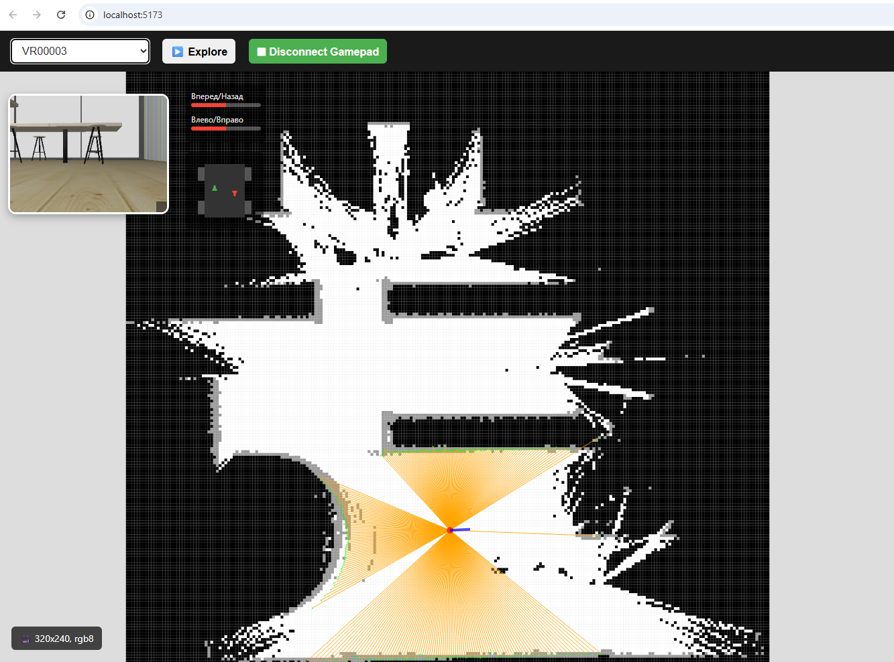

# 🤖 Zenoh Robot Explorer

Веб-интерфейс для удалённого управления роботами через протокол **Zenoh**. Проект позволяет подключаться к роботам в реальном времени через REST API Zenoh, просматривать карту, лидар, видеопоток и управлять движением: исследование среды, ручное управление с геймпада, отправка целей по клику, работа с вейпоинтами и режим "змейки" по полигону.

[](https://www.typescriptlang.org/)
[](https://vitejs.dev/)
[](LICENSE)

## ✨ Основные возможности

- 🤖 **Автоматическое обнаружение роботов** через REST API Zenoh
- 🗺 **Просмотр карты** (OccupancyGrid), лидара (LaserScan) и камеры (Image)
- 🎯 **Отправка цели** (NavigateToPose) по клику на карте
- 🛣 **Режимы навигации**:
  - Одиночная цель
  - Последовательность вейпоинтов
  - Автоматическое исследование (frontier exploration)
- 🎮 **Управление с геймпада** (Gamepad API)
- 🔄 **Визуализация скорости колёс** робота в реальном времени
- 🖱 **Перемещение и изменение размера** окна камеры
- 📡 **Поддержка SSE** (Server-Sent Events) для потоковых данных
- 💾 **Сохранение положения и размера** камеры в localStorage
- 🧭 **Отображение текущей позиции** робота и траектории движения
- 📍 **Работа с вейпоинтами**: добавление точек и автоматическое следование по ним
- 🐍 **Режим "змейки"**: автоматическая генерация маршрута по выделенному полигону

## 🌐 Удаленное управление

Проект использует **REST API Zenoh** для подключения к роботам через интернет. Zenoh выступает как шлюз между веб-интерфейсом и роботами, которые могут находиться в локальной сети. Это позволяет управлять роботами удаленно без необходимости проброса портов или сложной настройки сети.

**Особенности удаленного подключения:**
- Подключение к роботам через публичный URL (например, `https://zenoh.robbox.online`)
- Работа через интернет без прямого доступа к локальной сети робота
- Все данные передаются в бинарном формате CDR, что обеспечивает эффективную передачу даже при ограниченной пропускной способности канала
- Поддержка различных типов сообщений ROS через Zenoh

## ⚙️ Технологии

| Категория | Технологии |
|-----------|------------|
| **Язык и сборка** | 📝 TypeScript + Vite |
| **Графика** | 🎨 Canvas 2D rendering |
| **Коммуникация** | 🌐 Zenoh over HTTP/REST, CDR serialization |
| **Сериализация** | 🔍 CDR-TS, OmgIDL-Serialization |
| **Интерфейс** | 🎮 Gamepad API, Web Workers |
| **Данные** | 📡 Server-Sent Events (SSE), localStorage |

## 🚀 Запуск проекта

### Предварительные требования

- Установленный Node.js (версия 16+)
- npm или yarn

### Установка зависимостей

```bash
npm install
# или
yarn install
```

### Запуск в режиме разработки

```bash
npm run dev
# или
yarn dev
```

### Сборка проекта

```bash
npm run build
# или
yarn build
```

Собранные файлы будут доступны в папке `dist/`.

## 🔧 Настройка подключения

Базовый URL Zenoh указан в коде:

```typescript
const ZENOH_REST_BASE = "https://zenoh.robbox.online";
```

При необходимости вы можете изменить его в файле `main.ts`, заменив значение `ZENOH_REST_BASE` на ваш собственный сервер.

## 🌍 Совместимость

Проект поддерживается в современных браузерах. Для корректной работы необходима поддержка:

- ✅ Canvas API
- ✅ EventSource (SSE)
- ✅ Gamepad API
- ✅ Web Workers
- ✅ TypeScript

💡 **Совет**: Для лучшего опыта используйте браузер с поддержкой всех современных веб-технологий, таких как Chrome, Firefox или Edge.

## 🤝 Как использовать

1. **Выберите робота** из выпадающего списка
2. **Нажмите "Explore"** для автоматического исследования среды
3. **Кликните по карте** для отправки цели роботу
4. **Используйте геймпад** для ручного управления (нажмите кнопку "Connect Gamepad")
5. **Добавляйте вейпоинты** для создания маршрута
6. **Изменяйте размер и позицию** окна камеры для удобства

## 📸 Интерфейс


*Основной интерфейс с картой, лидаром и окном камеры*

## 📝 Структура проекта

```
zenoh-camera-viewer/
├── src/
│   ├── config/              # ⚙️ Конфигурация и константы
│   │   └── index.ts
│   ├── types/               # 📦 TypeScript типы
│   │   ├── common.ts        # Базовые ROS типы
│   │   ├── ros-messages.ts  # Типы сообщений
│   │   └── index.ts
│   ├── schemas/             # 🔧 CDR схемы сообщений
│   │   ├── generator.ts     # Генератор схем
│   │   ├── ros-messages.ts  # Все схемы
│   │   └── index.ts
│   ├── services/            # 🌐 Сетевые сервисы
│   │   └── zenoh-client.ts  # Клиент Zenoh
│   ├── renderers/           # 🎨 Рендереры
│   │   ├── map-renderer.ts
│   │   ├── camera-renderer.ts
│   │   ├── lidar-renderer.ts
│   │   └── index.ts
│   ├── utils/               # 🛠️ Утилиты
│   │   ├── cdr-parser.ts
│   │   ├── validators.ts
│   │   ├── transforms.ts
│   │   ├── logger.ts
│   │   └── index.ts
│   ├── ui/                  # 🎮 UI компоненты
│   ├── legacy/              # 📦 Старые файлы (архив)
│   └── main.ts              # 🚀 Точка входа
├── index.html               # HTML страница
├── vite.config.ts           # Конфигурация Vite
├── tsconfig.json            # Конфигурация TypeScript
├── package.json             # Зависимости
├── README.md                # Документация
├── CODE_REVIEW.md           # Результаты код-ревью
├── REFACTORING.md           # Описание рефакторинга
└── .gitignore               # Git ignore правила
```

### 🎯 Основные модули

- **config/** - Централизованная конфигурация (URL, лимиты, настройки)
- **types/** - Строгая типизация всех ROS сообщений
- **schemas/** - Генератор и схемы для CDR парсинга
- **services/** - ZenohClient с автореконнектом и управлением подписками
- **renderers/** - Отдельные рендереры для камеры, карты и лидара
- **utils/** - Переиспользуемые утилиты (парсинг, валидация, координаты)

## 🏗️ Архитектура

Проект использует современную модульную архитектуру:

### ⭐ Генератор схем сообщений

Добавление нового ROS сообщения теперь требует всего **10 строк** вместо 100+:

```typescript
import { dictionary, field, baseTypes, headerSchema } from '@schemas';

export const myMessageSchema = dictionary({
  header: field(0, headerSchema),
  value: field(1, baseTypes.float32),
  data: field(2, sequence(baseTypes.uint8)),
});
```

### 🌐 ZenohClient

Умный клиент с автореконнектом:

```typescript
const zenohClient = new ZenohClient();

// Подписка с автоматическим переподключением
zenohClient.subscribe('robot1', 'scan', handleData);

// Автоматическая очистка
zenohClient.unsubscribeRobot('robot1');
```

**Возможности:**
- ✅ Автоматический реконнект (5 попыток)
- ✅ Управление всеми подписками
- ✅ Обработка ошибок
- ✅ Правильная очистка ресурсов

### 📊 Результаты рефакторинга

| Метрика | До | После | Улучшение |
|---------|-----|--------|-----------|
| Размер main.ts | 2043 строки | ~250 строк | **-88%** ⬇️ |
| Дублирование кода | ~15% | <3% | **-80%** ⬇️ |
| Использование `any` | ~30 раз | 5 раз | **-83%** ⬇️ |
| Модулей | 3 | 25+ | **+733%** ⬆️ |
| Новое сообщение | 100+ строк | 10 строк | **-90%** ⬇️ |

Подробнее о рефакторинге: [REFACTORING.md](REFACTORING.md)

## 🤝 Вклад в проект

Если вы хотите внести свой вклад в проект:

1. Форкните репозиторий
2. Создайте feature-ветку (`git checkout -b feature/amazing-feature`)
3. Закоммитьте изменения (`git commit -m 'Add amazing feature'`)
4. Запушьте в ветку (`git push origin feature/amazing-feature`)
5. Откройте Pull Request

См. [CONTRIBUTING.md](CONTRIBUTING.md) для подробностей

## 📄 Лицензия

Этот проект распространяется под лицензией ISC.

## 👨‍💻 Автор

**krikz** - [GitHub](https://github.com/krikz)

---

**Zenoh Robot Explorer** — мощный инструмент для удаленного управления роботами через веб-интерфейс с поддержкой современных технологий и интуитивно понятным интерфейсом. 🌐🤖
